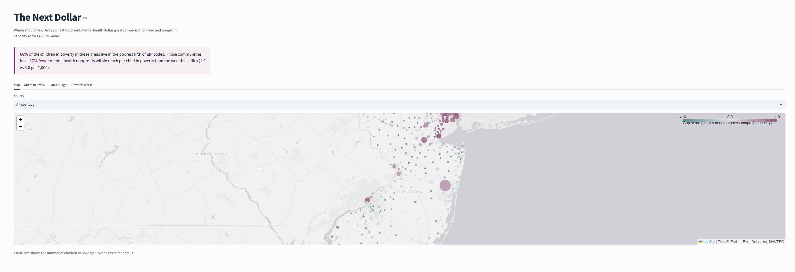

# The Next Dollar
### Where should New Jersey's next children's mental health dollar go?

**[Open the live dashboard](https://the-next-dollar-nj.streamlit.app/)**

<!-- Add a screenshot: save it as docs/dashboard.png, then keep the line below -->


Funding for children's mental health and autism services tends to follow donors and existing infrastructure rather than need. Foundations and public agencies deciding where to invest rarely have a local view of which communities have the most children in need and the least service capacity within reach.

This project compares need and nonprofit capacity across 489 New Jersey ZIP areas, identifies where the gap is largest, and includes a budget planner showing what a grant of a given size could accomplish under different funding strategies.

## Key findings

**1. The poorest communities have the least capacity within reach.** 68% of children in poverty in the areas studied live in the poorest fifth of ZIP areas. Those areas have 37% fewer mental health and developmental nonprofits within 10 miles per child in poverty than the wealthiest fifth (1.9 vs 3.0 per 1,000). The decline is steady across every poverty level (3.0, 2.7, 2.5, 2.4, 1.9), not driven by a few outliers.

**2. Most of the highest-need areas aren't federal shortage areas.** Of the 15 high-gap ZIP areas with the most children in poverty, 11 have no federal mental health shortage designation, including Jersey City (07305), Union City, West New York, New Brunswick, and Atlantic City. Federal designations measure clinician supply; they can miss places where community-based nonprofit services are thin.

**3. The largest affected communities are dense and urban.** Jersey City 07305 (5,456 children in poverty), New Brunswick (4,823), Bridgeton (4,456), Union City (4,349), and several Newark ZIP areas lead the list. New Brunswick and Perth Amboy stand out: roughly $240 to $275 of nonprofit capacity within reach per child in poverty, against a statewide typical level of about $2,580.

**4. The most severe gaps are rural.** Four Cape May County ZIP areas (Villas, Wildwood, Rio Grande, Cape May), plus three in Ocean County and one in Atlantic County, have no relevant nonprofit headquartered within 10 miles.

**5. The strategy matters as much as the budget.** Bringing every eligible high-gap area up to the statewide typical level would cost about $122M. A $500,000 grant can't fully fund even one area, and depending on the strategy it brings between 193 and 931 children up to that level:

| Strategy ($500K) | Area funded | Children brought to target |
|---|---|---|
| Most children reached per dollar | Newark 07103 | 931 |
| Most children in poverty first | Jersey City 07305 | 289 |
| Deepest gap first | Villas 08251 (Cape May) | 193 |

At $2.5M, the first strategy fully funds Newark 07103 (4,226 children in poverty, about $2.27M) and partially funds Newark 07102.

## Recommendation

For a single foundation with a grant in the $500K range, concentrate rather than spread. Spreading a small grant across many areas barely moves any of them. Newark 07103 offers the most children reached per dollar, and about $2.3M would close its gap entirely.

For state agencies and larger funders, use community need alongside federal shortage designations. Hudson County (Jersey City, Union City, West New York) and New Brunswick carry large gaps without federal designation, which also means they miss the loan-repayment and reimbursement benefits designation brings.

For rural Cape May County, a new organization may not be the right answer. The gap there is total absence rather than overcrowding, so extending an existing regional provider through a satellite office, school-based services, or telehealth is likely more practical. Local service directories should be checked first, since this data only sees headquarters.

These rankings are a starting point for conversations with local providers and families, not a substitute for them.

## Method

Need is a weighted blend of child poverty, children on Medicaid, uninsured children, and the share of each ZIP area inside a federal mental health shortage area.

Supply is measured with the two-step floating catchment area (2SFCA) method from health geography: each nonprofit's capacity is divided by the number of children in poverty within 10 miles of it, then summed for each ZIP area across every nonprofit it can reach. This accounts for competition, so an area next to a large provider still scores low if that provider is shared by many children. Capacity is measured both as organization count and as revenue, then blended so no single large organization dominates.

The gap score is need percentile minus supply percentile, from -1 (well served) to +1 (need far outpaces capacity).

**Robustness.** Rankings were recomputed under 4 weighting schemes and 5, 10, and 15-mile radii (12 scenarios). Rank correlations with the baseline ranged from 0.80 to 1.00. Changing the weights barely mattered (0.99 or higher at 10 miles); changing the travel distance mattered more (about 0.80 at 5 miles). 26 ZIP areas stayed in the top 10% in at least 80% of scenarios.

**Budget planner.** Eligible areas are high-gap ZIP areas at least 20% below the statewide typical level of capacity per child in poverty. The planner fills each area's shortfall in the order set by the chosen strategy until the budget runs out.

## Limitations

- IRS data lists nonprofit headquarters only, so regional providers with satellite offices (for example, in Cape May County) may be undercounted.
- Revenue is a fragile proxy for capacity. Adding one organization (Jewish Family Service of Atlantic County, $16.3M) moved Atlantic City from rank 10 to 61. Organization counts are blended in to limit this; program-level data such as caseloads or clinician counts would be better.
- Very large ZIP areas can top the "most children affected" list on size alone. Lakewood (08701) is the clearest case: the most children in poverty of any area, but a moderate gap score. Community-based and faith-based services there may not appear in IRS mental health categories.
- The headline uses organization counts rather than dollars, because counts decline consistently as poverty rises while revenue per child does not.
- Keyword matching initially caught Spanish-language church names ("Bautista" contains "autis"). Fixed with word-boundary matching and by excluding organizations coded as religious congregations.
- Substance abuse organizations (NTEE F20 to F22) are excluded as primarily adult-focused. This is a scope choice.
- HRSA's shortage area ID field was blank in the source file, so census tracts were decoded from component names (for example, "Census Tract 10.01" becomes tract code 001001), and designated towns were mapped to ZIP codes by hand. Woodbridge's ZIP mapping is approximate.
- An early version applied shortage designations to whole counties, which wrongly flagged areas like Westfield (1.1% child poverty). Designations are now mapped at the tract and town level.
- The first version of the budget planner counted areas already near the target as "reached," inflating results (one area received about $2 per child and counted 3,113 children). Fixed by requiring areas to be at least 20% below target and reporting dollars added per child.
- The budget planner treats each area separately, although capacity is shared across neighboring areas.
- Census estimates for small areas have wide margins of error, so ZIP areas with fewer than 500 children are excluded.

## Data sources

- IRS Exempt Organizations Business Master File Extract (New Jersey)
- U.S. Census Bureau, American Community Survey 5-year estimates, 2023 (ZIP Code Tabulation Areas)
- HRSA Mental Health Professional Shortage Areas
- Census 2020 ZCTA-to-county and ZCTA-to-tract relationship files; 2023 Census Gazetteer

## How to run

```bash
pip install -r requirements.txt
export CENSUS_API_KEY=your_key   # free at api.census.gov/data/key_signup.html
python src/01_ingest.py          # download sources into DuckDB
python src/02_transform.py       # clean and join into one table per ZIP area
python src/03_score.py           # need, supply, gap scores and sensitivity analysis
streamlit run app.py             # dashboard
```

## Project structure

```
src/01_ingest.py      data download and loading
src/02_transform.py   cleaning, joins, data quality checks
src/03_score.py       2SFCA access scores, gap ranking, robustness tests
app.py                Streamlit dashboard
data/processed/       final scores used by the dashboard
```
